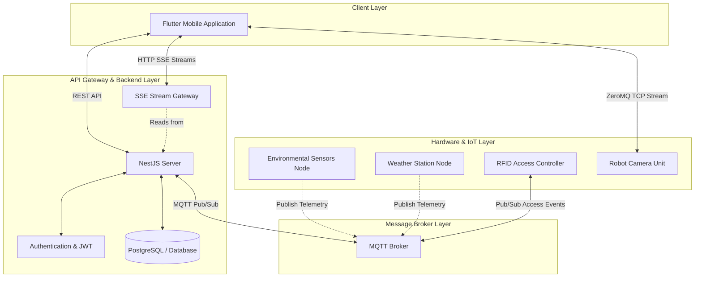
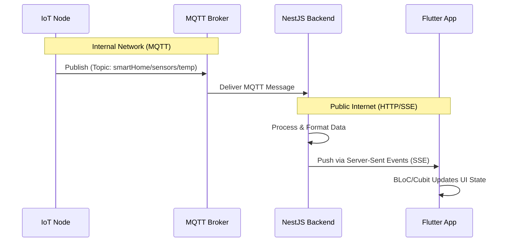
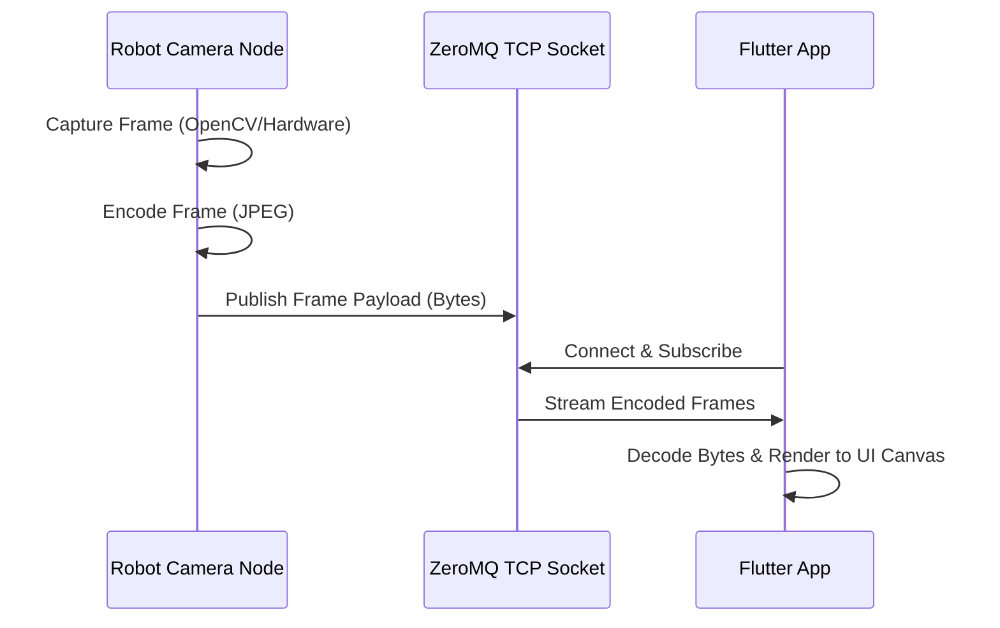
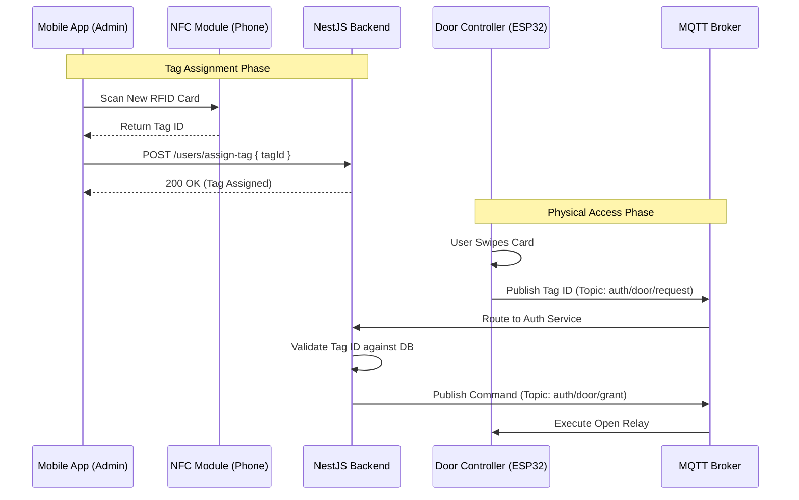
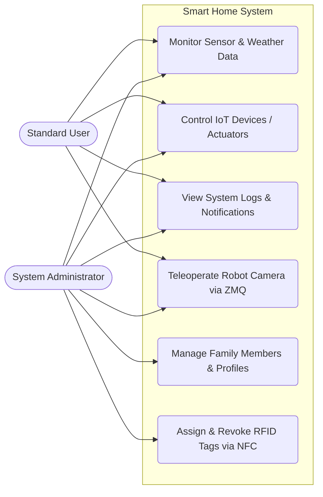

# Comprehensive Technical Report: A Unified IoT Smart Home System

## Table of Contents
1. [Abstract](#1-abstract)
2. [Introduction](#2-introduction)
   - 2.1 Background
   - 2.2 Problem Statement
   - 2.3 Objectives
   - 2.4 Scope of Work
3. [System Architecture Overview](#3-system-architecture-overview)
   - 3.1 High-Level Architecture Diagram
   - 3.2 Tiered Architecture Breakdown
4. [Hardware Layer & Node Configuration](#4-hardware-layer--node-configuration)
   - 4.1 Environmental Sensors Node
   - 4.2 Weather Station Node
   - 4.3 RFID Door Access Node
   - 4.4 Robotic Teleoperation Node
   - 4.5 Hardware Pin Mapping Reference
   - 4.6 Inter-IC (I2C) Communication Specifics
5. [Communication Protocols & Networking](#5-communication-protocols--networking)
   - 5.1 Real-Time Telemetry via Server-Sent Events (SSE)
   - 5.2 Low-Latency Video Streaming via ZeroMQ (ZMQ)
   - 5.3 MQTT Broker and Topic Management
6. [Software Architecture: Mobile Application](#6-software-architecture-mobile-application)
   - 6.1 Flutter Framework & Cross-Platform Nature
   - 6.2 Clean Architecture Implementation
   - 6.3 State Management using BLoC/Cubit
   - 6.4 Dependency Injection (GetIt)
   - 6.5 User Interface and Glassmorphism Design
   - 6.6 SSE Implementation Details in Dart
   - 6.7 ZMQ Sub-socket Lifecycle
7. [Software Architecture: Backend System](#7-software-architecture-backend-system)
   - 7.1 NestJS Framework & API Gateway
   - 7.2 Security & Authentication Workflow
   - 7.3 RFID Tag Provisioning via NFC
   - 7.4 SSE Implementation Details in NestJS
   - 7.5 Database Schema Overview
8. [Comprehensive API Documentation](#8-comprehensive-api-documentation)
   - 8.1 Authentication Endpoints
   - 8.2 User Management Endpoints
   - 8.3 Actuator Control Endpoints (MQTT Bridge)
   - 8.4 Telemetry Streams (SSE)
9. [System Use Cases & Roles](#9-system-use-cases--roles)
   - 9.1 System Use Case Diagram
   - 9.2 Key System Features
10. [Testing & Validation](#10-testing--validation)
    - 10.1 Flutter Unit and Widget Testing
    - 10.2 NestJS Integration Testing
    - 10.3 Hardware-in-the-loop (HIL) Testing
11. [Deployment & DevOps](#11-deployment--devops)
    - 11.1 Backend Containerization (Docker)
    - 11.2 CI/CD Pipeline
    - 11.3 Remote Access Configuration (NGINX/Tailscale)
12. [Performance, Security, and Scalability](#12-performance-security-and-scalability)
    - 12.1 Overcoming Mobile MQTT Constraints
    - 12.2 Security Considerations
13. [Conclusion & Future Work](#13-conclusion--future-work)
    - 13.1 Summary
    - 13.2 Future Enhancements
    - 13.3 Final Remarks
14. [Appendices](#14-appendices)
    - 14.1 MQTT Topic Topology Reference
    - 14.2 IoT Payload Schemas

---

## 1. Abstract

The modern smart home ecosystem requires seamless integration between distributed IoT sensors, secure backend services, and a unified user interface. This technical report details the architecture, design patterns, and implementation of a comprehensive Smart Home system. The platform consists of a Flutter-based mobile application, a NestJS backend acting as a central orchestration hub, an MQTT message broker for hardware communication, and ZeroMQ (ZMQ) for low-latency robotic teleoperation. 

A primary architectural decision in this project involves decoupling the mobile client from direct hardware communication. Previously, mobile clients subscribed directly to the MQTT broker, leading to high battery consumption, persistent background connection issues, and security vulnerabilities. This architecture mitigates those issues by leveraging **Server-Sent Events (SSE)** for all real-time telemetry updates. The system achieves high performance, enhanced security, and extended battery life on mobile devices, establishing a scalable foundation for future IoT integration.

---

## 2. Introduction

### 2.1 Background
The Internet of Things (IoT) has revolutionized home automation, transforming isolated electrical appliances into an interconnected ecosystem. Traditional implementations rely heavily on the Message Queuing Telemetry Transport (MQTT) protocol, which is excellent for machine-to-machine (M2M) communication. However, adapting M2M protocols directly to mobile applications often results in suboptimal performance. 

### 2.2 Problem Statement
In earlier iterations of smart home systems, the mobile application maintained a direct TCP connection to the MQTT broker. This approach presented several critical issues:
1. **Battery Drain:** Keeping a persistent MQTT connection open prevents the mobile device's radio from entering low-power idle states.
2. **Connection Instability:** Mobile devices frequently switch between cellular and Wi-Fi networks, causing MQTT connections to drop and requiring complex reconnection logic.
3. **Security Risks:** Exposing the MQTT broker directly to the public internet for the mobile app to consume increases the attack surface.
4. **Video Latency:** Standard video streaming protocols (like RTSP or HTTP Live Streaming) introduce significant latency, making them unsuitable for real-time robot teleoperation.

### 2.3 Objectives
To resolve the aforementioned challenges, this project outlines the following objectives:
1. **Centralized Orchestration:** Route all telemetry, command execution, and access control through a secure API gateway (NestJS).
2. **Real-Time Telemetry via SSE:** Deliver live sensor and weather data to the client using Server-Sent Events (SSE), eliminating the need for a direct MQTT connection from the mobile app.
3. **Low-Latency Teleoperation:** Implement a lightweight, high-performance video streaming protocol utilizing ZeroMQ (ZMQ) for a remote-controlled robot camera.
4. **Secure Access Control:** Integrate RFID-based authentication for physical door access, managed dynamically via the mobile application and backed by a relational database.

### 2.4 Scope of Work
This report covers the entire software stack, focusing primarily on the Flutter mobile application, its communication with the NestJS backend, and the abstraction of hardware interaction. Firmware code and hardware schematics are treated as external dependencies supplying data to the broker.

---

## 3. System Architecture Overview

### 3.1 High-Level Architecture Diagram
The following diagram illustrates the decoupled nature of the system. The Flutter application interacts strictly with the backend via REST and SSE. For high-bandwidth video data, the application connects directly to the robot node via a ZeroMQ TCP stream, completely bypassing traditional HTTP routing to minimize latency.



### 3.2 Tiered Architecture Breakdown
1. **Client Layer:** The Flutter mobile application, providing a unified dashboard for teleoperation, monitoring, and administrative controls.
2. **API Gateway Layer:** The NestJS backend acts as the sole orchestrator. It absorbs all MQTT traffic, processes it, and serves it to authorized clients.
3. **Broker Layer:** A Mosquitto MQTT broker handling lightweight, QoS-based messaging for microcontrollers.
4. **Hardware Layer:** ESP8266, ESP32, and Arduino microcontrollers equipped with localized sensors and actuators.

---

## 4. Hardware Layer & Node Configuration

While this report focuses on the application software, understanding the data origins is crucial for context. The IoT ecosystem comprises specialized microcontroller nodes.

### 4.1 Environmental Sensors Node
Equipped with DHT11 (Temperature & Humidity) and MQ2 (Gas/Smoke) sensors. This node publishes localized safety metrics to the broker. It is critical for fire and gas leak detection. It frequently polls environmental parameters every 3 seconds.

### 4.2 Weather Station Node
Collects external environmental data, aggregating metrics such as ambient light, rainfall, and external temperature. This node often communicates via I2C to a master transmitter, which then publishes the aggregated payload to unified weather topics.

### 4.3 RFID Door Access Node
Manages physical security. It reads MIFARE/NFC tags and delegates authentication logic to the centralized backend via MQTT messaging. The node itself contains no user database; it relies entirely on the NestJS backend's verdict.

### 4.4 Robotic Teleoperation Node
A mobile unit equipped with a camera module. Unlike telemetry nodes, this unit prioritizes bandwidth and latency. It serves video frames directly over a ZeroMQ socket, allowing the mobile application to render real-time views.

### 4.5 Hardware Pin Mapping Reference
For reference, the hardware relies on standard GPIO bindings:
- **Sensors:** DHT11 on Digital Pin 6, MQ2 on Analog Pin 0.
- **Relays:** Lamps on D1/D2, Fans on D5/D6, Alarm on D7.
- **RFID Module:** MFRC522 connected via standard SPI (MISO, MOSI, SCK) and Chip Select on Pin 5.

### 4.6 Inter-IC (I2C) Communication Specifics
The Weather Station uses an Arduino as an I2C slave to package telemetry into a 6-byte binary payload. This payload is requested by the ESP8266 Master Node, which parses the fixed-point integers into float values before passing them via MQTT to the NestJS backend.

---

## 5. Communication Protocols & Networking

The core innovation of this architecture is the strategic selection of networking protocols based on the specific requirements of the data payload.

### 5.1 Real-Time Telemetry via Server-Sent Events (SSE)
Historically, the mobile application established a direct MQTT socket connection. To minimize overhead and improve battery life, this has been entirely deprecated in favor of **Server-Sent Events (SSE)**.

**Why SSE over MQTT?**
- **Unidirectional Flow:** Sensor telemetry is strictly server-to-client. SSE is designed explicitly for this, maintaining a single HTTP connection and streaming text data natively supported by all modern network layers.
- **Battery Efficiency:** Mobile operating systems are highly optimized for handling long-lived HTTP connections, whereas persistent custom TCP sockets (MQTT) prevent radio sleep states.
- **Security:** The MQTT broker is firewalled inside the internal network. Only the NestJS backend has access to it.



### 5.2 Low-Latency Video Streaming via ZeroMQ (ZMQ)
For the robot teleoperation feature, video latency is the primary constraint. Standard protocols like RTSP or WebRTC involve significant signaling overhead, STUN/TURN server negotiations, and complex codecs.

The system instead utilizes **ZeroMQ (ZMQ)**, a high-performance asynchronous messaging library. 
The robot camera captures frames, compresses them into raw JPEG byte arrays, and publishes them over a ZMQ `PUB` socket. The Flutter application uses a ZMQ `SUB` socket over TCP, decodes the raw byte payload, and renders it directly to a memory-backed image canvas. This approach achieves sub-second latency, which is critical for real-time robotic maneuvering without colliding with obstacles.



### 5.3 MQTT Broker and Topic Management
The internal Mosquitto broker organizes data hierarchically. Topics are strictly separated by domain (e.g., `smartHome/sensors/...`, `smartHome/weather/...`, `smartHome/devices/...`). The NestJS backend acts as a bridge, translating incoming REST POST requests from the mobile app into outgoing MQTT publications to control actuators (lights, doors, fans).

---

## 6. Software Architecture: Mobile Application

The client application is built using the Flutter framework, ensuring native compilation and 120Hz rendering performance across both iOS and Android platforms.

### 6.1 Flutter Framework & Cross-Platform Nature
Flutter's declarative UI paradigm aligns perfectly with the reactive nature of IoT telemetry. When an SSE payload arrives, the framework efficiently rebuilds only the affected widget subtrees (such as a temperature gauge).

### 6.2 Clean Architecture Implementation
To guarantee maintainability, the codebase is structured around Clean Architecture principles:
- **Presentation Layer:** UI widgets, Pages, and state management (Cubits).
- **Domain Layer:** Business entities, use cases, and repository interfaces. This layer is entirely agnostic of whether data comes from REST, SSE, or ZMQ.
- **Data Layer:** Remote data sources, HTTP clients (Dio), and ZMQ socket handlers.

### 6.3 State Management using BLoC/Cubit
State mutation is handled by the **Cubit** pattern (a lightweight variant of BLoC). Each domain feature operates independently:
- `SensorsCubit`: Listens to the SSE stream and updates the indoor metrics.
- `WeatherCubit`: Listens to the weather SSE stream.
- `DevicesCubit`: Manages the state of actuators (lights, doors) via REST API calls.
- `RobotCubit`: Manages the ZMQ socket lifecycle and frame rendering.

### 6.4 Dependency Injection (GetIt)
All services, repositories, and network clients are provided as singletons or factories via the `get_it` service locator. This ensures that the SSE client and REST clients are centralized and can easily share authentication interceptors.

### 6.5 User Interface and Glassmorphism Design
The user interface utilizes a modern "Glassmorphism" design system, characterized by translucent, frosted-glass panels over vibrant gradients. This aesthetic choice provides a premium, futuristic feel appropriate for an advanced smart home system. Dynamic micro-animations provide immediate tactile feedback when users interact with actuators.

### 6.6 SSE Implementation Details in Dart
In Flutter, Server-Sent Events are consumed utilizing standard HTTP stream listening mechanisms. Unlike WebSockets, SSE strictly requires standard HTTP libraries.
```dart
// Example of the conceptual Dart implementation for SSE
Stream<SensorData> getSensorStream() async* {
  final client = http.Client();
  final request = http.Request('GET', Uri.parse('http://api.smarthome.local/sse/sensors'));
  request.headers['Authorization'] = 'Bearer $token';
  
  final response = await client.send(request);
  yield* response.stream
    .transform(utf8.decoder)
    .transform(const LineSplitter())
    .where((line) => line.startsWith('data:'))
    .map((line) => SensorData.fromJson(jsonDecode(line.substring(5))));
}
```

### 6.7 ZMQ Sub-socket Lifecycle
The Robot Teleoperation feature relies on a clean lifecycle for the ZMQ socket. The socket connects only when the Robot Page is active and explicitly disconnects in the `dispose()` method of the widget. This ensures no background memory leaks occur.

---

## 7. Software Architecture: Backend System

The backend is engineered using **NestJS**, an enterprise-grade framework for Node.js built with TypeScript.

### 7.1 NestJS Framework & API Gateway
NestJS organizes code into heavily decoupled Modules. The system includes:
- `MqttModule`: Handles the persistent connection to the Mosquitto broker.
- `SseModule`: Multiplexes incoming MQTT messages into HTTP streams for mobile clients.
- `AuthModule`: Manages user authentication, JWT generation, and password hashing.
- `DevicesModule`: Exposes REST endpoints for controlling actuators.

### 7.2 Security & Authentication Workflow
All HTTP endpoints (including SSE connections) are protected by JSON Web Tokens (JWT). The system implements Role-Based Access Control (RBAC) to differentiate between standard household members and system administrators. Administrators have exclusive rights to create new user profiles and provision physical access tokens.

### 7.3 RFID Tag Provisioning via NFC
Physical access control merges mobile device capabilities with hardware execution. An administrator uses the mobile application's built-in NFC reader (`nfc_manager`) to scan a new physical MIFARE RFID card. The tag's UID is extracted and transmitted to the backend via a secure REST endpoint (`POST /users/assign-tag`). The backend binds this UID to a specific user profile. 

When the user physically swipes the tag on the door's hardware reader, the reader consults the backend (via MQTT routing). The backend validates the tag against the database and, if authorized, publishes a command to the MQTT broker to trigger the physical door relay.



### 7.4 SSE Implementation Details in NestJS
Within the NestJS controller, RxJS Observables are utilized to push data continuously over an open HTTP socket.
```typescript
@Sse('sensors')
@UseGuards(JwtAuthGuard)
sseSensors(): Observable<MessageEvent> {
  return this.mqttService.getSensorStream().pipe(
    map((payload) => ({ data: payload } as MessageEvent)),
  );
}
```

### 7.5 Database Schema Overview
The NestJS application uses TypeORM with PostgreSQL. The central entity is the `User` table, which holds relations to assigned RFID tags (`cardTag`) and user roles (`ADMIN` or `USER`). The telemetry history is stored in a time-series optimized format for future graph generation on the mobile app.

---

## 8. Comprehensive API Documentation

The backend exposes a highly formalized REST API. The below documentation serves as a quick reference for the available endpoints consumed by the Flutter application.

### 8.1 Authentication Endpoints
- **POST `/auth/login`**
  - Payload: `{ username, password }`
  - Returns: JWT Access Token and Refresh Token.
- **POST `/auth/refresh`**
  - Payload: `{ refreshToken }`
  - Returns: New Access Token.

### 8.2 User Management Endpoints
- **GET `/users/me`**
  - Returns: Profile of the currently authenticated user.
- **POST `/users/assign-tag`** (Admin Only)
  - Payload: `{ tagId: "A1B2C3D4" }`
  - Action: Binds the provided NFC UID to the active profile.
- **POST `/users`** (Admin Only)
  - Payload: User registration fields.
  - Action: Provisions a new family member account.

### 8.3 Actuator Control Endpoints (MQTT Bridge)
These endpoints abstract the MQTT payload formulation. The Flutter app simply sends a standard HTTP POST, and the backend handles the MQTT stringification.
- **POST `/mqtt/setLed/lamp1`** | **POST `/mqtt/setLed/lamp2`**
  - Payload: `{ state: "on" | "off" }`
- **POST `/mqtt/setfan/fan1`** | **POST `/mqtt/setfan/fan2`**
  - Payload: `{ state: "on" | "off" }`
- **POST `/mqtt/setAlarm`**
  - Payload: `{ state: "on" | "off" }`
- **POST `/mqtt/setDoor`**
  - Payload: `{ command: "unlock" }`

### 8.4 Telemetry Streams (SSE)
- **GET `/sse/sensors`**
  - Stream Output: `{ temperature: 24.5, humidity: 45, gas: 12 }`
- **GET `/sse/weather`**
  - Stream Output: `{ light: 80, water: 0, temp: 28, hum: 40 }`

---

## 9. System Use Cases & Roles

The system supports multiple authorization levels, explicitly defining the boundaries of control for different types of users within the household.

### 9.1 System Use Case Diagram
The following flowchart outlines the capabilities of Standard Users versus System Administrators.



### 9.2 Key System Features
- **Live Telemetry Dashboard:** Visualizes environmental metrics using Server-Sent Events (SSE). Seamlessly updates without polling, displaying indoor metrics (temperature, gas) and weather station data.
- **Actuator & Access Control Panel:** Allows remote operation of hardware nodes. Commands sent via REST APIs are translated into MQTT payloads by the backend to toggle smart relays and locks.
- **Advanced Robot Teleoperation:** A dedicated interface providing an immersive, game-controller style experience. It relies on a transparent joystick overlay and renders ultra-low-latency video frames fetched via a ZeroMQ TCP socket.
- **Family & Access Management:** Utilizing the mobile device's NFC capabilities, administrators can scan physical cards and bind them to user profiles dynamically.
- **Audit Logging & Notifications:** A searchable log repository detailing every automated and manual system action, ensuring full system observability.

---

## 10. Testing & Validation

### 10.1 Flutter Unit and Widget Testing
The mobile app utilizes the native `flutter_test` suite. Cubits are tested extensively using `bloc_test` to mock API responses and ensure states transition correctly from `Loading` to `Loaded` or `Error`. Widget tests are performed on custom UI components, asserting that glassmorphism effects render without pixel overflows.

### 10.2 NestJS Integration Testing
Backend APIs are tested using Jest and Supertest. This ensures that endpoints correctly require JWT authentication, role guards prevent standard users from accessing `/users/assign-tag`, and that REST payload mapping correctly issues mock MQTT commands.

### 10.3 Hardware-in-the-loop (HIL) Testing
The hardware was tested using real sensors before integrating with the backend. Mock scripts were also written to simulate high-frequency sensor readings to ensure the NestJS SSE implementation could handle heavy load without dropping event frames.

---

## 11. Deployment & DevOps

### 11.1 Backend Containerization (Docker)
The NestJS backend, along with the PostgreSQL database and the Mosquitto broker, is fully containerized using Docker. A `docker-compose.yml` file is provided in the repository to spin up the entire internal infrastructure with a single command. 

### 11.2 CI/CD Pipeline
GitHub Actions are configured to automatically lint, analyze, and test both the Flutter application and the NestJS backend upon pull requests to the `main` branch. This ensures no breaking changes are introduced into the master branch.

### 11.3 Remote Access Configuration (NGINX/Tailscale)
Since the MQTT broker must not be exposed directly to the internet, remote access is facilitated via Tailscale VPN for administrative access, while end-users access the NestJS REST API through an NGINX reverse proxy secured by Let's Encrypt SSL certificates. This guarantees data in transit is fully encrypted.

---

## 12. Performance, Security, and Scalability

### 12.1 Overcoming Mobile MQTT Constraints
As emphasized throughout this report, the decision to remove direct MQTT access from the Flutter application is a foundational architectural shift. Mobile operating systems aggressively kill background TCP connections that are not standard HTTP. By shifting to SSE:
1. The app relies on standard HTTP networking, which the OS handles gracefully.
2. The complexity of managing topic subscriptions, connection drops, and reconnect backoffs is entirely offloaded to the NestJS server.
3. The backend can aggregate, throttle, or sanitize data before the mobile client ever sees it, saving massive amounts of client-side processing power.

### 12.2 Security Considerations
- **No Exposed Broker:** The MQTT port (1883) is not port-forwarded to the internet. It exists strictly on the local area network.
- **API Authentication:** Every request from the mobile app requires a valid Bearer JWT.
- **Database Sanitization:** The NestJS backend uses TypeORM and class-validator to ensure all incoming data is structurally sound, preventing injection attacks.
- **Role-Based Limitations:** Even if a user discovers the endpoint to add an RFID tag, the backend will reject the request if the JWT does not contain an administrative role claim.

---

## 13. Conclusion & Future Work

### 13.1 Summary
This project successfully demonstrates a highly decoupled, scalable, and secure IoT architecture. By offloading MQTT handling to a robust backend and utilizing Server-Sent Events (SSE) for client-side telemetry, the system ensures optimal mobile performance and battery efficiency. The integration of ZeroMQ (ZMQ) provides a lightweight, highly responsive teleoperation experience, entirely bypassing the sluggishness of traditional web streaming protocols. Furthermore, NFC/RFID integration bridges the gap between physical hardware security and digital profile management.

### 13.2 Future Enhancements
The architecture is designed to be highly extensible. Planned future enhancements include:
- **Indoor Localization (RSSI):** Integrating a spatial localization engine using a machine learning ensemble on a FastAPI backend, visualized through a Three.js 3D frontend embedded within the Flutter app.
- **Predictive Automation:** Implementing chron-jobs and behavioral learning algorithms within the NestJS backend. By analyzing historical telemetry, the system will proactively adjust climate control and lighting based on usage patterns.
- **Push Notification Migration:** Transitioning critical alerts (such as fire detection or unauthorized door access) from in-app polling to Firebase Cloud Messaging (FCM). This will enable persistent, background-delivered notifications even when the application is closed.
- **Edge AI Processing:** Moving some of the camera's computer vision tasks (such as facial recognition or object detection) directly onto the robotic node to trigger automated alerts via ZMQ.
- **Cloud Database Synchronization:** Expanding the PostgreSQL instance to a managed cloud database for highly available, multi-region failovers.

### 13.3 Final Remarks
The abstraction of hardware protocols behind a unified backend server serves as the blueprint for scalable commercial IoT solutions. By favoring standard mobile networking protocols (REST/SSE) over industrial M2M protocols (MQTT) on user devices, the resulting application is robust, performant, and secure.

---

## 14. Appendices

### 14.1 MQTT Topic Topology Reference
| Domain | Topic String | Purpose |
|--------|-------------|---------|
| Sensors | `smartHome/devices/dht11/temperature/state` | Temperature telemetry |
| Sensors | `smartHome/devices/mq2/gas/state` | Gas/Smoke levels |
| Weather | `smartHome/weather/light/state` | Ambient light metrics |
| Weather | `smartHome/weather/water/state` | Rainfall/Water metrics |
| Actuators | `smartHome/devices/lamp/lamp1/set` | Toggle lamp relay |
| Auth | `smartHome/devices/door/testCard` | RFID UID broadcasting |

### 14.2 IoT Payload Schemas
Incoming MQTT telemetry payloads expect JSON formatting to ensure easy parsing by the backend:
```json
// Example Gas Payload
{
  "value": 15
}
```
Actuator outgoing payloads follow the generic set schema:
```json
// Example Lamp Command
{
  "set": "on"
}
```

---
*Developed as an academic capstone project in advanced IoT systems engineering, software architecture, and cross-platform mobile development.*
